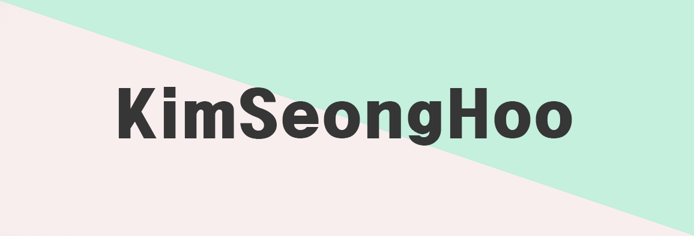

👋 Hi there! I'm a student who junior grade of Gyeonggi game meister highschool👋  
  
🕹I'm working hard to become a mobile game developer.🎮

<h1> 💪Skills </h1>

Platforms & Languages  
  
</a>
</a>
  
</a>
</a>
</a>
</a>

🔨Tools🔨  
  
</a>
</a>
</a>
</a>
</a>
<h2> </h2>

